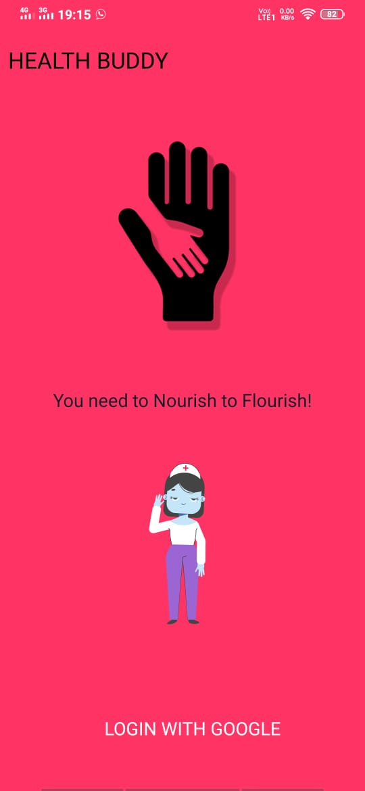
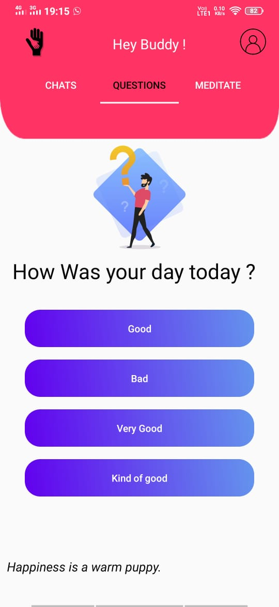
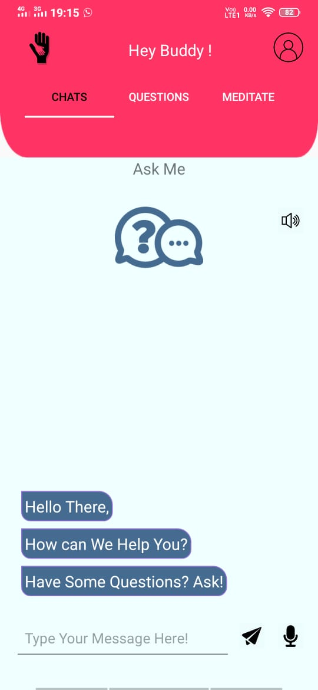
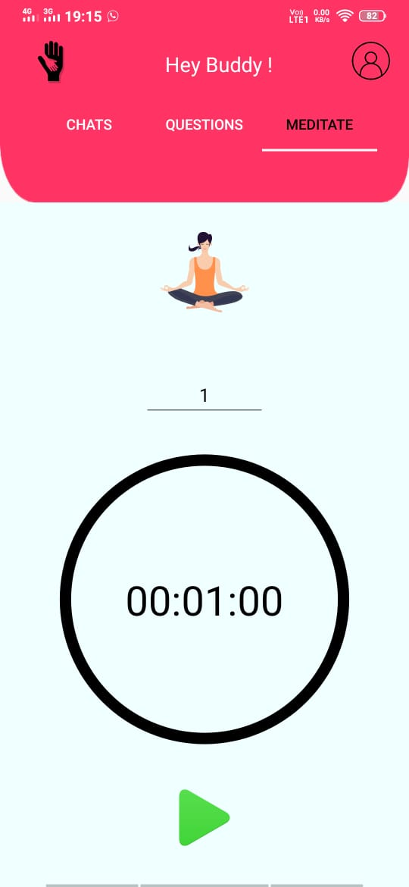
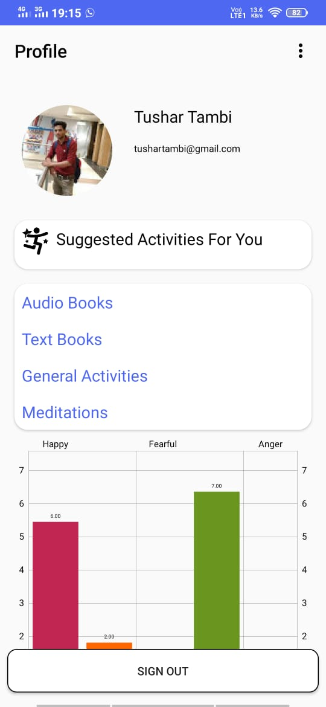

# HealthBuddy :syringe:

There used to be a time where the common cold could cause an epidemic. And today, we’ve eradicated malaria and are on the path to finding cures to cancer and AIDS. While direct medical sciences have contributed to most of its advancements, recent years have seen computer sciences compliment it very well. As of 2017, India’s population stood at 133.92 crores out of which 15 crores require one or the other forms of mental support or treatment. India accounts for nearly 15% of global mental health issues which is expected to increase to a staggering 20% by 2020. The proposed idea should be able to have an impact to disrupt using state-of-the-art technologies.

----
### So improvise on that, we have HealthBuddy!!!
#### To talk more about it. Let's start with for whom this app is for -
- Have hesitation in sharing their feeling/need.
- Have lack of confidence
- Have fear of what others may think?
- Have any kind of mental issues.
- Busy in work and can not go to psychologist
-----
### So What it contains:
- Questionnaires
  > Daily questionnaire to check the psychological condition of the user.
- Ask Me ( Text and Speech)
  > Health guide is built using ML for user’s personal guidance without revealing his/her identity.
- Meditation
  > Meditation page to provide users different sounds of nature with a stopwatch.
- Progress Tracker
  > Provide day to day progress according to asked questionnaire The user is provided an option to visit a psychologist or to a psychiatrist based on the severity of his case.

## Under the Hood :
#### ~~yes, it's not complete~~
- This app provides what therapist one should visit -> **Psychologist** or **psychiatrist** . Which no other app or website tells one. The app may collaborate with renowned Psychologist and psychiatrist to further solve the problem of the users.
- Evaluating scores using facial expression. 
- Working on evaluating scores using tension in users voice pitch. 

----
## Finally look down at our UI
<kbd></kbd>    <kbd></kbd>    <kbd></kbd> 

<kbd></kbd>  <kbd></kbd> 

----
#### Last but not the least, thank you for your precious time for reading it all. If in case you've any suggestions, file an issue :heart: and we'll try to solve it.
## Thank you, Good Day! :+1:

----
#### Update: Chat Bot in HealthBuddy is not working as our Api for it has not been hosted. Still if anyone want to check it out, can visit the api [here](https://github.com/rishab247/HealthBuddy_API) .
